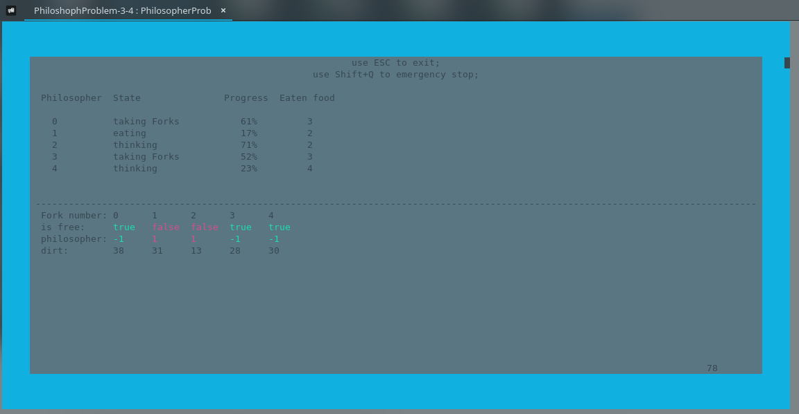

# dining philosophers problem (problem ucztujących filozofów SO2)

for english scroll down

## Ten program spróbuję rozwiązać problem ucztujących filozofów na 3 sposoby:

- Za pomocą kelnera, który daje naczynia przy umowie, że oba naczynia są wolne.
- Za pomocą hierarchii zasobów: najpierw jest pobierany lewy widelec, później prawy. Zwrócenie naczyń zachodzi w odwrotnej kolejności ( prawy -> lewy). Dla ostatniego filozofa pobieranie i zwolnienie naczyń zachodzi w odwrotnej kolejności w stosunku do innych ( pobieranie: prawy -> lewy, zwolnienie: lewy -> prawy).
- podobny do sposobu nr.2, ale przy "długim" czasie zajętości spotrzebowanego widelca już zajmowany zezwala się i próba otrzymać naczynia powtarza.

## KOMPILACJA:

```
./makefile
```

## URUCHOMIENIE:

```
./PhilosopherProblem [tup rozwiązania] [liczba filozofów]
```

parametry (nie obowiązkowe)

typy rozwiązań:
1 - kelner
2 - zwykła hierarchia
3 - hierarchia z "zezwalaniem"
domyślny typ rozwiązania - kelner
domyślnia liczba filozofów - 5

Przykład uruchomienia 8 filozofów z hierarchią z "zezwalaniem":

```
./PhilosopherProblem 3 8
```

### Przyciski wewnątrz programu:

- ESC - wyjście z porządnym zamykaniem wątków
- Shift+Q - wymusza zajęcie wątków i awaryjne wyjście z programu

#### !UWAGA: podczas działania interfejsu graficznego działają tylko przyciski ESC i Shift+Q, w inne momenty Ctrl+C wywoła zwykłe zamknięcie programu!



# dining philosophers problem

## This program will try to solve the problem of dining philosophers in 3 ways:

- Using a manager that gives forks if both (right and left) are free.
- Using the resource hierarchy: first, the left fork is selected, then the right fork. The forks are returned in reverse order (right - > left). For the last philosopher, the collection and release of vessels occurs in reverse order ( take: right - > left, release: left - > right).
- similar to method # 2, but with the" long " busy time of the consumed fork, the occupied resources (fork) are released.

## Compilation:

```
./ makefile
```

## Run:

```
./ PhilosopherProblem [solution type] [number of philosophers]
```

parameters (not necessary)

types(ways) of solutions:
1-waiter
2 - normal hierarchy
3 - Hierarchy with "permission"
default solution type - waiter
default number of philosophers-5

Example of running 8 philosophers with a hierarchy with "permissiveness":

```
./ PhilosopherProblem 3 8
```

### Buttons inside the program:

- ESC - exit with closing threads
- Shift+Q - force exit (killing the threads)

#### !Warning: only the ESC and Shift+Q buttons are works when the GUI is running, if GUI not running Ctrl+C will shut down the program!


